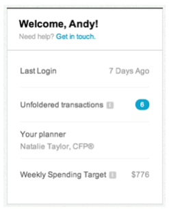

# LearnVest
1. [Task 1 - Risk Analysis](#Risks)
1. [Task 2 - Data Analysis](#Data)
1. [Task 3 - Test Cases](#TestCases)
1. [Task 4 - Issue Triaging](#IssueTriaging)
1. [Task 4 - Automation](#Automating)

## Scenario
You are given the task to test out a new area of the website that gives the user a snapshot of important information once they login.  You are given both an image of the design and acceptance criteria / requirements. Please review them below:



### Acceptance Criteria / Requirements
Users should see a welcome module in which they are presented with the following information:

1. A welcome message which includes their first name
1. Information about the last time they logged in
1. Number of bank/credit card transactions they have which need to be manually categorized by the user. 
    - Categories are normally assigned automatically via an algorithm.  
    - Example category might be rent, gas, restaurants, etc.  
    - In the case where it can’t automatically be categorized, it will be `unfoldered`.
    - Clicking on this link takes you to a transactions screen
1. The name of your planner
1. How much money you are allowed to spend every week

### <div id="Risks">Task 1</div>

Write a list of questions or uncertainties you may have that you would ask a designer or stakeholder concerning the image or acceptance criteria/requirements.

### Task 1 - Response

So I took the liberty of categorizing my list of questions or uncertainties.  
For each within, `DES` = designer, `PRO` = product, `STA` = stakeholders.

#### Best Practices
1. Acceptance criteria should be documented in the form of user stories. See [Profile_Overview_Component_FSD.md](./components/stories/Profile_Overview_Component_FSD.md) `PRO`
1. Design specifications should be contained to views or viewports where applicable.
    - In the context of this, let's call it `Profile Overview Component`, it either is contained within a parent element, like a menu or a modal or view of its own. See [Profile_Overview_Component_Design.png](./components/design/Profile_Overview_Component_Design.png).
    - Also the design should state the view port it is being enhanced for. For the example above the viewport it is optimized for is `1024X768`
1. Design should be done mobile first. `PRO` & `DES`
1. Design should reference a pattern library for components. `PRO` & `DES`
1. Design should also reference a style guide. `PRO` & `DES`
    - Style guides usually reference fonts used, 
    - sizes for optimization across device and web kits,
    - taglines and marketing goals to be teargeted.
1. Specifications should also reference Compatibility and Boundary `PRO`
1. Design can be optimized using tools like [https://www.invisionapp.com/](https://www.invisionapp.com/) and the like. `DES`

#### User Experience
1. It isn't clear as to whether or not  is a button or a modal on hover displaying information. It is also used twice in separate locations, where one is documented to be a link to another view. `DES`
1. Buttons and links should be clearly defined for the user as call to actions. `DES`
1. Unclear as to whether [modular scale](http://www.degordian.com/education/blog/best-practice-for-responsive-typography/) or [responsive font size practices](http://typecast.com/blog/a-more-modern-scale-for-web-typography) are used. `DES`
1. Unclear as to whether [atomic design](http://atomicdesign.bradfrost.com/) approaches are practiced. `DES`

#### Test Scope
1. Which view(s) is (are) this component a child of?
1. Does the test plan for this component extend itself to the modules that it includes? `STA`
    - For example, `Unfoldered Transactions Component`. 
    - Does this test plan include testing it against an acceptance criteria of its' own?
    - If so, are there `epics` & `stories` for them? (see example: [Profile_Overview_Component_FSD.md](./components/stories/Profile_Overview_Component_FSD.md))
1. Is this `Profile Overview Component` static or refreshed on a cron or a "last-update" basis? `STA`
1. Are all modules for this component functional? `STA` 
    - For example the contact via `Get in touch`. 
    - Given for `1`, it is in the scope of this test. 
1. Is this component a priority feature for the `smoke` suite? `STA`
1. Should it also be in the the `regression` suite? `STA`
1. Are there any known caveats or issues to take in to consideration? `STA`

### <div id="Data">Task 2</div>
Write a list of data or users in a certain state that you may need to properly test this.

### Task 2 - Response

In [Profile_Overview_Component_FSD.md](./components/stories/Profile_Overview_Component_FSD.md), the user stories contain some of the variables, parameters and states that I need at minimum to test these stories.

They look like:

```cucumber
Scenario: I want to view the last time I logged in
Given I am on My Profile Overview
And I am `$(isLoggedIn)`
Then I should see `Last Login`
And I should see `$(lastLoggedIn)`
```

#### Test Data and States
1. User types:
    - Ideal User
        - This user meets all required data points,
        - including the optional data points,
        - ideally a user in the system with reoccurring transactions.
    - Secondary Ideal User 
        - This user meets all required data points,
        - missing *n* optional data points,
        - inconsistent transaction history.
    - Invalid User
        - A user that is either not verified or doesn't meet member requirements,
        - therefore, returns `Logged Out` or `Verification Required`,
        - user could also not exist in the system.
1. States for each user type, except invalid:
    - A user with multiple integrations and ongoing history, no `unfoldered transactions`.
    - A user less than 1 integration and no ongoing history, less than 2 `unfoldered transactions`.
    - A user less than 1 integration and ongoing history, with multiple `unfoldered transactions`.
    - A user with no planner.
    - A user with a planner with no certifications.
    - A user with an unusually old `Last Login` date.
    - A `new` user.
    - A user with a high `Weekly Spending Target`.
    - A user with a medium `Weekly Spending Target`.
    - A user with a low `Weekly Spending Target`.
    - A user with no current generated `Weekly Spending Target`.
    - Logged out user.
    - Logged in user.
    - User in changed password state.
1. Views and states applicable:
    - For example, `Settings` view.

### <div id="TestCases">Task 3</div>
Write a list of high-level test scenarios that you can think of based only on the design and acceptance criteria you are given. After you list them out, number them in terms of priority (`1` - must test, `2` - should test, `3` - test only if there is time).

### Task 3 - Response
See the stories here: [Profile_Overview_Component_FSD.md](./components/stories/Profile_Overview_Component_FSD.md).

| Priority | Scenario | Reason |
| --- | --- | --- |
| 1 | I want to use my profile overview | This is the epic, parent for all children that follows. |
| 2 | I want a customized welcome message | Seems secondary to `Unfoldered Transactions` & `Weekly Spending Target` |
| 2 | I want to view the last time I logged in | Seems secondary to `Unfoldered Transactions` & `Weekly Spending Target` |
| 1 | I want to view my notifications | This module is the parent for `Unfoldered Transactions`. |
| 1 | I want to view the number of Unfoldered Transactions I have | Seems that this is a main driver for this service, tied closer to marketing goals. |
| 1 | I want to view my planner | Seems that this is also a main driver for this service, tied closer to marketing goals. |
| 1 | I want to view my Weekly Spending Target | Seems that this is also a main driver for this service, tied closer to marketing goals. |

### <div id="IssueTriaging">Task 4</div>
Imagine that you find a defect while testing the above. Write a sample defect report.

### Task 4 - Response
I actually [wrote about this](http://blog.sajjad.nyc/2015/11/11/The-Art-of-Reproducing-Bugs.html) a while ago. Here are the snippets that apply:

1. Where the issue was observed?
1. What site was this on?
1. What browser or device were you using? 
1. What are the steps to reproduce the issue? 
1. What was the expected result? 
1. What was the actual result? 
1. Other things that you should include in your bug ticket:
    1. Any specification documents relating to the functionality. This helps provide a trail and additional information when working on the issue.
    1. Screenshots or video of the issue. Sometimes a picture is worth a thousand words, and a video is worth exponentially more than that. These can provide insight into the issue that a written description never could.

#### TICKET-123

**Summary:** Clicking `Unfoldered Transactions` redirects user to `/404`
 
**Environment:** Environment Agnostic, issue discovered on Chrome 39.x.x, [http://example.com/Profile](http://example.com/Profile), Logged in as `testUser_09`/`passwrd0`

**Acceptance Criteria:** [Link to JIRA, Trello, etc.]()

**Description:**  
Steps to reproduce:

1. Navigate to [http://example.com](http://example.com)
1. Log in as `testUser_09`
1. Press `Profile` from navigation bar
1. Press `Unfoldered Transactions`
1. Notice user is redirected to `/404`
1. **Expected:** to be on `/Profile`

### <div id="Automating">Task 5</div>
What scenarios would you consider valid for automation? Why?

### Task 5 - Response
This component is small enough to be able to be quickly automated, at least for the `green` or `valid paths`. The paths of which do not test error handling or edge cases. However, they should be noted so they can be automated later. Automating based on a priority scale is important too.

Given that the concerns regarding the test scope are addressed and all components are expected to be tested apart of this test plan, then automating around `Unfoldered Transactions` & `Weekly Spending Target` components is a good strategy.

Take each story in [Profile_Overview_Component_FSD.md](./components/stories/Profile_Overview_Component_FSD.md), flesh out scenarios for each test type, or scaffold scenarios under each type, for the types applied.

1. Black-Box
1. White -Box
1. Unit
1. Incremental Integration
1. Integration
1. Functional
1. System
1. End-to-End
1. Sanity
1. Regression
1. Acceptance, UAT
1. Load
1. Stress
1. Performance
1. Usability
1. Installation
1. Recovery
1. Security
1. Compatibility
1. Comparison
1. Alpha
1. Beta

After mapping epics, stories and scenarios to suites to test types, a test plan and schedule should be drafted.
