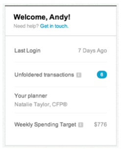
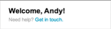
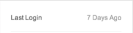
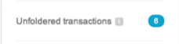
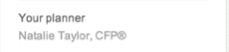
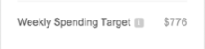

# Profile Overview Component
- Functional Specification Document 
- Version 0.0.1
- Author: Sajjad Hossain

## Epic
- [Link to JIRA, Trello, etc.]()



```cucumber
As a user
I want to use my profile overview
So that I can view last login, my planner, notifications and budget
```
## Stories
### Welcome, `$(name)`!
- A welcome message which includes their first name.
- [Link to JIRA, Trello, etc.]()



```cucumber
Scenario: I want a customized welcome message
Given I am on My Profile Overview
And I am `$(isLoggedIn)`
Then I should see `$(message)`
And I should see `Get in touch.`
When I follow `Get in touch.`
I should be on `$(contact)`
```

### Last Login
- Information about the last time they logged in.
- [Link to JIRA, Trello, etc.]()



```cucumber
Scenario: I want to view the last time I logged in
Given I am on My Profile Overview
And I am `$(isLoggedIn)`
Then I should see `Last Login`
And I should see `$(lastLoggedIn)`
```

### Notifications
- [Link to JIRA, Trello, etc.]()

```cucumber
Scenario: I want to view my notifications
Given I am on My Profile Overview
And I am `$(isLoggedIn)`
Then I should see `$(notificationBadgeCount)`
And I should see `$(notificationSubject)`
```

#### Unfoldered Transactions
- Number of bank/credit card transactions they have which need to be manually categorized by the user. 
    - Categories are normally assigned automatically via an algorithm.  
    - Example category might be rent, gas, restaurants, etc.  
    - In the case where it can’t automatically be categorized, it will be `unfoldered`.
    - Clicking on this link takes you to a transactions screen
- [Link to JIRA, Trello, etc.]()



```cucumber
Scenario: I want to view the number of Unfoldered Transactions I have
Given I am on My Profile Overview
And I am `$(isLoggedIn)`
Then I should see `Unfoldered Transactions`
And I should see `$(unfolderedTransactionCount)`
When I click on `$(unfolderedTransactionCount)`
Then I should be on My Transactions Screen
```

### Your Planner
- The name of your planner.
- [Link to JIRA, Trello, etc.]()


   
```cucumber
Scenario: I want to view my planner
Given I am on My Profile Overview
And I am `$(isLoggedIn)`
Then I should see `Your Planner`
And I should see `$(plannerName)`
And I should see `$(plannerCertification)`
```

### Weekly Spending Target
- How much money you are allowed to spend every week.
- [Link to JIRA, Trello, etc.]()


   
```cucumber
Scenario: I want to view my Weekly Spending Target
Given I am on My Profile Overview
And I am `$(isLoggedIn)`
Then I should see `Weekly Spending Target`
And I should see `$(amount)`
When I click ??*1
```

#### Risks / Concerns

1. *1 Undefined as to if the component is meant to be an button or link to another view.
